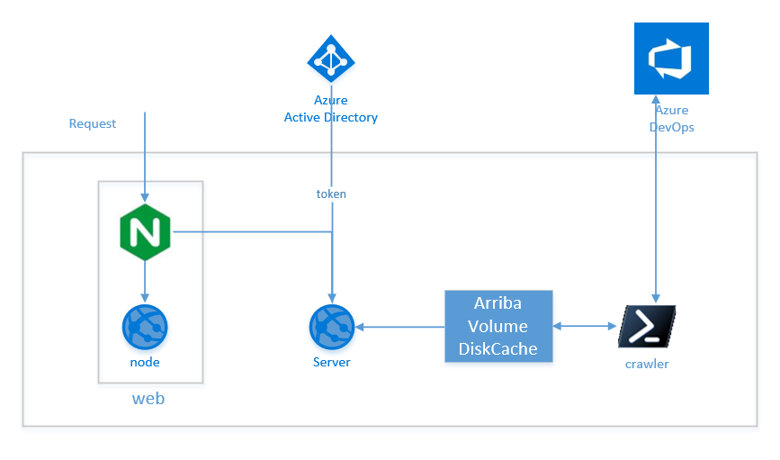

# Running Arriba with Docker Compose

This document provides the necessary steps for you to get the Arriba services running using the data from your Azure Devops.

### Prerequisites

- [Azure Devops][azure-devops]
- [Docker][docker-get-started]

### Application Architecture

The application consists in three services:

1. **Web**: is a react app that also has a NGINX process configured as a reverse proxy.
2. **Server**: is a Web Api developed in AspNet core
3. **Crawler** console application developed in dotnet core



Azure Active Directory is used for OAuth (Authentication) using the code flow, it is an optional feature and is disabled by default.

To use the Crawler you have to provide an Azure DevOps Personal Token, check this document [Use personal access tokens][azure pat]

Azure DevOps is the data source and for this setup it is mandatory, if you don't have access to Azure DevOps you can still use Arriba to consume other data sources, check [Arriba QuickStart][Arriba QuickStart].

### Why using docker-compose?

Docker compose make things easy to build and run multi-container applications, as it is able to generate all the images, when defined the build section, and run all the container with one single command.

### Docker-compose file

We are using a [multi-stage build][docker-multistage-build] approach to generate the images, by using the multi-stage build the Docker files stays clean with and the we also have a faster build process. Let's take a close look to the docker-compose.yml file located at the project root.

```dockerfile 
   1  version: '3'
   2  volumes:
   3    arriba:
   4
   5  services:
   6    base:
   7      image: arriba-base
   8      build:
   9        context: ./src
  10        dockerfile: Dockerfile
  11    crawler:
  12      build:
  13        context: .docker/Crawler
  14        dockerfile: Dockerfile
  15      depends_on:
  16        - base
  17      volumes:
  18        - arriba:/Arriba/DiskCache
  19      environment:
  20        ARRIBA__AZPAT: ${AZPAT}
  21    server:
  22      build:
  23        context: .docker/Server
  24        dockerfile: Dockerfile
  25      depends_on:
  26        - base
  27      volumes:
  28        - arriba:/Arriba/DiskCache
  29      environment:
  30        ARRIBASERVER__OAUTHCONFIG__APPSECRET: ${APPSECRET}
  31    web:
  32      build:
  33        context: .docker/WebUI
  34        dockerfile: Dockerfile
  35      depends_on:
  36        - base
  37      ports:
  38        - 8080:80
```

At line 2 a volume named arriba is defined, this volume will be used to store the data crawled.

The file defines four services at the services section lines: 6,11,21 and 31.

The base service (line 6) is referenced by all the others services, this image is based on the dotnet core sdk image mcr.microsoft.com/dotnet/core/sdk.

Crawler service (line 11) is a dotnet core console application it uses the Azure DevOps api to get the data that will be consumed by the Server (line 21).

Server is an ApsNet Core web API that will be consumed by the Web service (line 31)

The only exposed service is the Web service (line 31), the service uses a NGINX reverse proxy to redirect the request to the website or the server.

### Changing application settings

Those are the configuration files that application is using.

- .docker/Crawler/service-config/cseng/appsettings.json
- .docker/WebUI/Configuration/Configuration.jsx
- .docker/Server/appsettings.json

There are no secrets defined at the settings, for passing the secrets the application is relaying on environment variables (lines 20 and 30) If the authentication is disabled there is no need to use the APPSECRET.

Create the environment variables

```bash
export AZPAT=<Azure Personal Token>
export APPSECRET=<Azure Active Directory App Secret>
```

### Building and Running

To build the image run the following command at the project root folder.

``` bash
docker-compose build
```

When executing the process for the first time the process takes a while.

To execute it runs

```bash
docker-compose up
```

We will start seeing the logs from the different services.
Go to the browser and open [Arriba local][arriba-local]

### Enabling Authorization

The application is using Azure Active Directory as an Identity Provider, in order to enable this feature it is necessary to create an Application in your tenant.

Open the Azure portal and access the Active Directory and  follow this steps:

1. At the left menu clicks over "App Registration"
2. Clicks over "+ New registration"
3. Provide a name for the application "arriba", for instance
4. Supported Account Types: Keep the application as a Single tenant
5. Clicks on "Register"
6. At the left menu clicks over "Certificates & secrets"
7. On Client secrets clicks over "+ New client secret"
8. type a name and clicks over "Add" (Save the value, as it is not going to be able to see it again this is your AppSecret)
9. At the left menu clicks over "Authentication"
10. Clicks over "+ Add a platform"
11. Clicks over "Web"
12. Redirect URIs: use this value "http://localhost:8080/data/api/oauth/auth-code"
13. Enable "IdToken" and "Access token"
14. Clicks over "Configure"
15. At the left menu clicks over "Manifest"
16. Change the property "accessTokenAcceptedVersion": null to "accessTokenAcceptedVersion": 2
17. Save the changes (upper left)
18. At the left menu clicks in "Overview"

Go to .docker/Server/appsetings.json and update the settings

```json
"ArribaServer": {
    "EnabledAuthentication": true,
    "FrontendBaseUrl": "http://localhost:8080/",
    "OAuthConfig": {
      "RedirectUrl": "http://localhost:8080/data/api/oauth/auth-code",
      "TenantId": "[Directory (Tenant) ID]",
      "AudienceId": "[Application (client) ID]",
      "Prompt": "login",
      "Scopes": [ "openid", "[Application (client) ID]/.default" ]
    }
  }
```

Don't forget to also enable to Authentication, property EnabledAuthentication.

The AppSecret will be exposed using environment variables.

### Troubleshooting

One of the main issues that can happen is related to configuration overwritten, the order of precedence is:

1. appsettings.json
2. appsettings.local.json
3. appsettings.{Development|Debug}.json
4. Environment Variables
5. Command Line Arguments

The configuration loader class has a method that can add another json file after the loading process, when it is used it also overwrite previously loaded values.

[azure-devops]: https://dev.azure.com
[docker-get-started]: https://www.docker.com/get-started
[azure pat]:https://docs.microsoft.com/en-us/azure/devops/organizations/accounts/use-personal-access-tokens-to-authenticate
[Arriba QuickStart]: https://github.com/Microsoft/elfie-arriba/wiki/Arriba-QuickStart
[docker-multistage-build]: https://docs.docker.com/develop/develop-images/multistage-build/
[arriba-local]:http://localhost:8080
